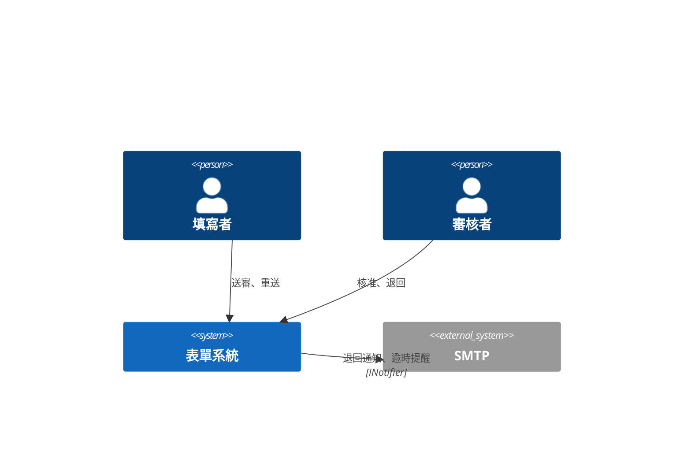
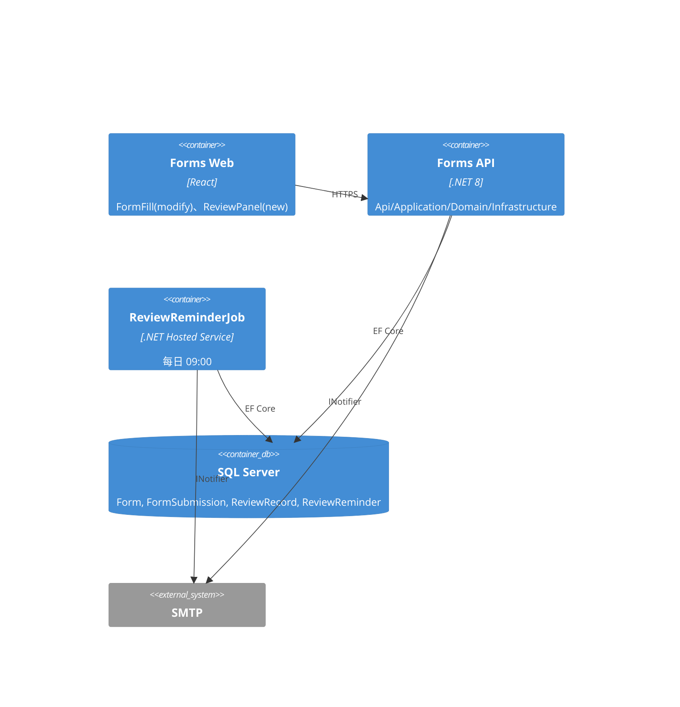
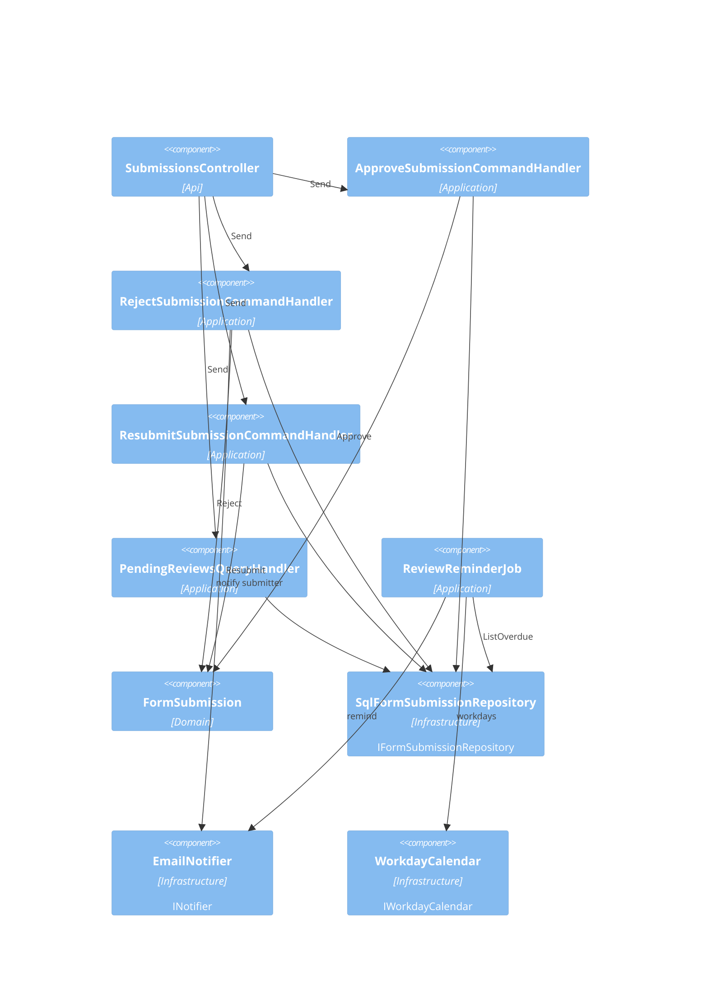
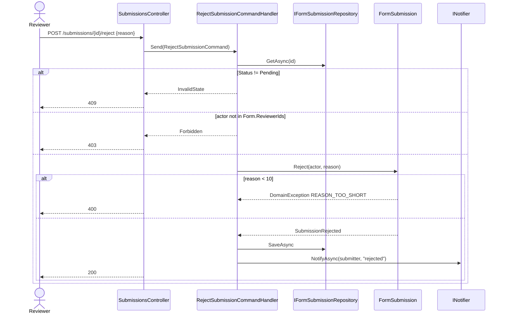
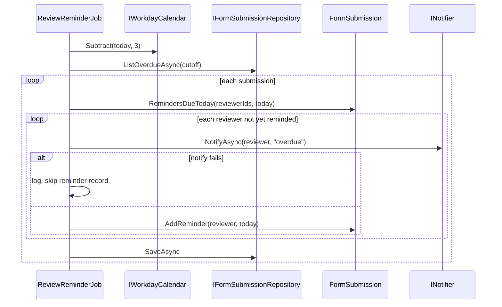

# 表單審核流程 — 架構(C4)

## Context(L1)
### C4-L1

## Container(L2)
### C4-L2

## Component(L3)
survey 狀態:existing 沿用、modify 既有修改、new 新增(見 spec-review/survey-mapping.md)。

| ID | 名稱 | Layer | Context | depends | external | 技術 |
|---|---|---|---|---|---|---|
| CMP-001 | SubmissionsController(new) | Api | Forms | CMP-002, CMP-003, CMP-004, CMP-009 | | ASP.NET Core |
| CMP-002 | ApproveSubmissionCommandHandler(new) | Application | Forms | CMP-005, CMP-006 | | MediatR |
| CMP-003 | RejectSubmissionCommandHandler(new) | Application | Forms | CMP-005, CMP-006, CMP-007 | | MediatR |
| CMP-004 | ResubmitSubmissionCommandHandler(new) | Application | Forms | CMP-005, CMP-006 | | MediatR |
| CMP-005 | FormSubmission (Aggregate, modify) | Domain | Forms | | | |
| CMP-006 | SqlFormSubmissionRepository : IFormSubmissionRepository(modify) | Infrastructure | Forms | | | EF Core |
| CMP-007 | EmailNotifier : INotifier(existing) | Infrastructure | Forms | | SMTP | |
| CMP-008 | ReviewReminderJob(new) | Application | Forms | CMP-005, CMP-006, CMP-007, CMP-010 | | ASP.NET Core |
| CMP-009 | PendingReviewsQueryHandler(new) | Application | Forms | CMP-006 | | MediatR |
| CMP-010 | WorkdayCalendar : IWorkdayCalendar(new) | Infrastructure | Forms | | | |

### C4-L3

## 追溯(AC → 技術元件)
| AC | CMP | via | 職責 |
|---|---|---|---|
| AC-001-1 | CMP-005 | STM-DOM-001 | Submit 設 Status=Pending(既有 Create 改) |
| AC-001-2 | CMP-004 | UC-003 | Pending 時拒絕修改 → 409 |
| AC-001-2 | CMP-005 | STM-DOM-001 | 守衛:只有 Rejected 可 Resubmit |
| AC-002-1 | CMP-001 | SEQ-001 | POST approve,取 actor |
| AC-002-1 | CMP-002 | SEQ-001 | 編排:載入、審核者檢查、Approve、儲存 |
| AC-002-1 | CMP-005 | SEQ-001 | Approve:狀態轉移 + ReviewRecord |
| AC-002-1 | CMP-006 | SEQ-001 | 持久化 ReviewRecord |
| AC-002-2 | CMP-005 | SEQ-001 | Reject 守衛 reason.Length ≥ 10 |
| AC-002-2 | CMP-001 | SEQ-001 | DomainException → 400 REASON_TOO_SHORT |
| AC-002-3 | CMP-003 | SEQ-001 | 編排:Reject、儲存、發 SubmissionRejected |
| AC-002-3 | CMP-005 | SEQ-001 | Reject:Rejected + ReviewRecord + 事件 |
| AC-002-3 | CMP-007 | SEQ-001 | 通知填寫者 |
| AC-003-1 | CMP-004 | UC-003 | 編排:驗答案、Resubmit、儲存 |
| AC-003-1 | CMP-005 | STM-DOM-001 | Resubmit:Rejected → Pending,ResubmitCount++ |
| AC-003-2 | CMP-005 | STM-DOM-001 | Approved 不可 Resubmit → 409 |
| AC-004-1 | CMP-008 | SEQ-002 | 每日:查逾時、排除已提醒、通知、寫 ReviewReminder |
| AC-004-1 | CMP-010 | SEQ-002 | 工作天計算(缺口 #3) |
| AC-004-1 | CMP-006 | SEQ-002 | ListOverdueAsync |
| AC-004-1 | CMP-007 | SEQ-002 | 發提醒 |
| AC-004-2 | CMP-005 | SEQ-002 | ReviewReminder (ReviewerId, Date) 唯一 |
| AC-004-2 | CMP-008 | SEQ-002 | 排除今日已提醒 |
| AC-N01-1 | CMP-001 | API-002 | 回應時間量測點 |
| AC-N02-1 | CMP-006 | ERD-001 | 無 Delete/Update 方法;DB 觸發器拒絕 |
| AC-N03-1 | CMP-002 | SEQ-001 | 非審核者 → 403 |
| AC-N03-1 | CMP-003 | SEQ-001 | 非審核者 → 403 |

## Sequence
### SEQ-001 審核(UC-002 / REQ-002)

### SEQ-002 逾時提醒(UC-004 / REQ-004)

