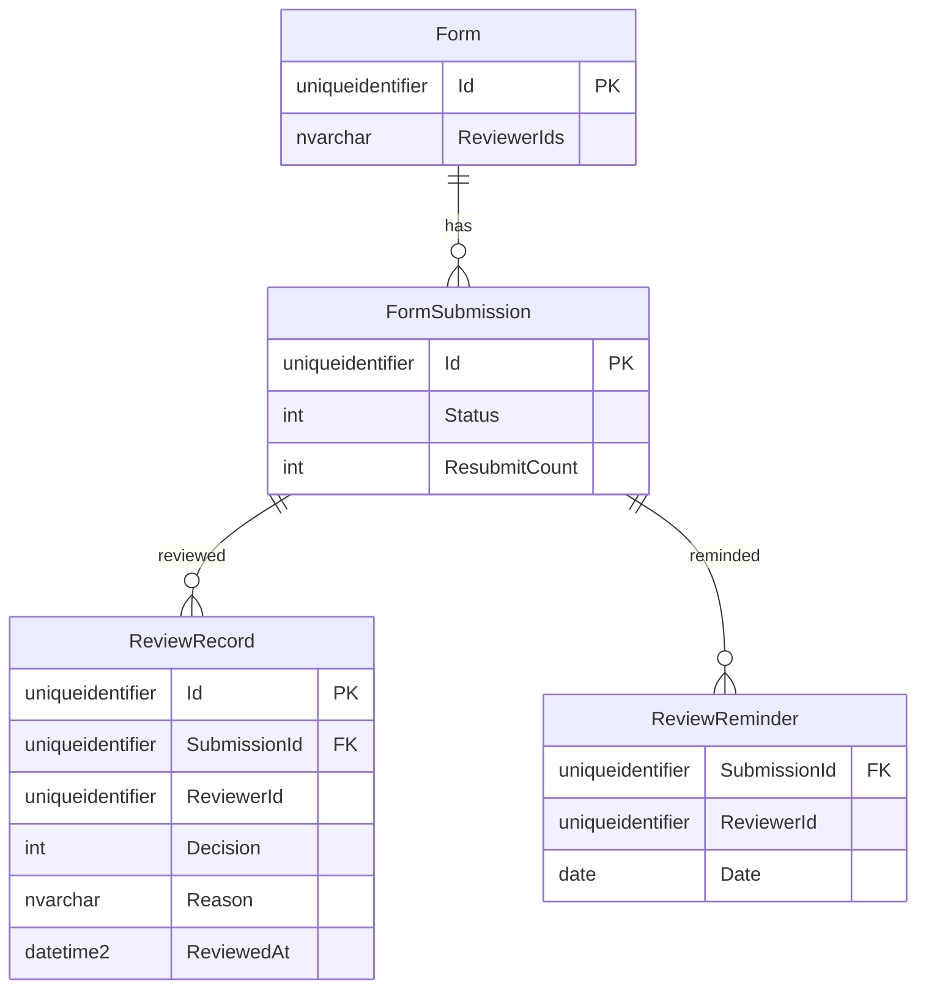

# 表單審核流程 — 資料模型

## 資料表
### ERD-001

| 表 | 欄位 | 型別 | 鍵/索引 | 說明 |
|---|---|---|---|---|
| Form | ReviewerIds | nvarchar(max) JSON | | 缺口 #1,先存 JSON 陣列 |
| FormSubmission | Status | int | IX_FormSubmission_Status_SubmittedAt | 0 Pending / 1 Approved / 2 Rejected |
| FormSubmission | ResubmitCount | int | | |
| ReviewRecord | * | | PK Id; IX SubmissionId | 無 UPDATE/DELETE;trigger 拒絕(NFR-002) |
| ReviewReminder | * | | PK (SubmissionId, ReviewerId, Date) | 防同日重複 |

## 擁有權
| 表 | Owner Context | 其他 Context 存取方式 |
|---|---|---|
| Form | Forms | — |
| FormSubmission | Forms | — |
| ReviewRecord | Forms | 經 API-005 |
| ReviewReminder | Forms | — |

## 遷移
- 修改表:Form 加 ReviewerIds;FormSubmission 加 Status(既有資料回填 1 Approved,因 issue-b 的送出等於生效)、ResubmitCount 0
- 新增表:ReviewRecord、ReviewReminder(`src/database/003_reviews.sql`)
- 保留期:ReviewRecord 永久(NFR-002)
