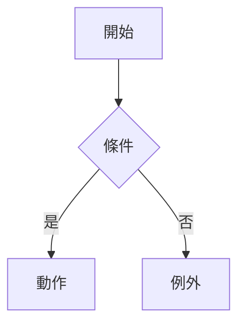
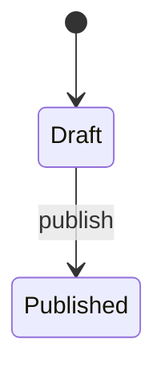
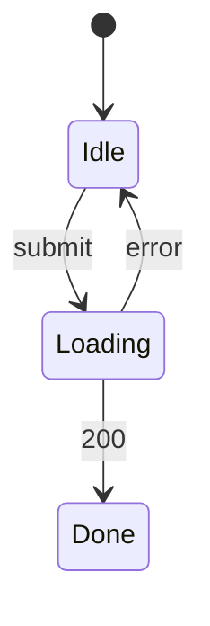
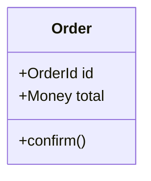

# {feature-title} — 領域模型

## Use Case
<!-- Cockburn 格式。後置條件是不變量(M5)與測試斷言(M17)的來源,缺了 Gate WARN -->
### UC-001 {名稱}(REQ-001)
- 主要參與者:
- 觸發:
- 前置條件:
- 後置條件(成功保證):
- 主流程:
  1. 
- 替代流程:
- 例外流程:

## 狀態機
<!-- 分兩種,不可混:
     STM-DOM-xxx 領域狀態機:狀態會持久化或影響業務規則(訂單生命週期)。放這裡。
     STM-UI-xxx  介面狀態機:從 mock 抽出的畫面狀態(idle/loading/done)。放「介面狀態」小節,不進 Aggregate。
     都沒有就寫「不適用:領域狀態數 < 3」 -->
### STM-DOM-001 {Aggregate 名稱}(REQ-001)

### 介面狀態
### STM-UI-001 {畫面名稱}(REQ-001)

## 領域模型
<!-- 只為 domain_rich 型態建 Aggregate。判準:有自己的生命週期 + 有跨多個物件的一致性約束。
     兩者缺一 → 是既有 Aggregate 的 Entity / Value Object,不要新建 -->
| 類型 | 名稱 | 不變量 | 所屬 Aggregate | 來源 UC 後置條件 |
|---|---|---|---|---|
| Aggregate Root | | | | |
| Entity | | | | |
| Value Object | | | | |
| Domain Event | | | | |

### CLS-001 {Aggregate 名稱}(REQ-001)

