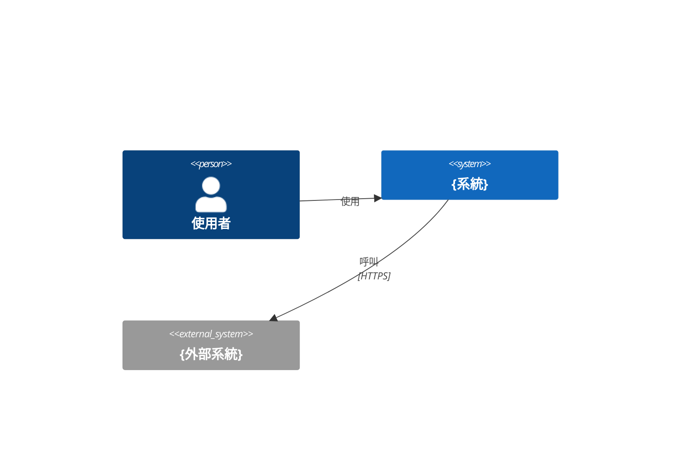
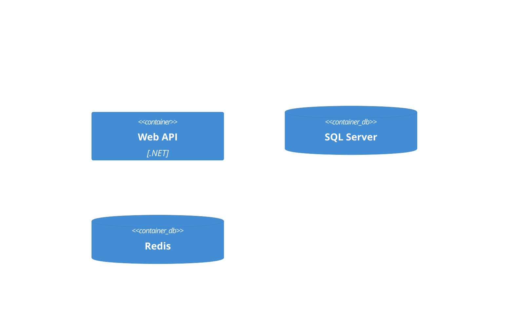
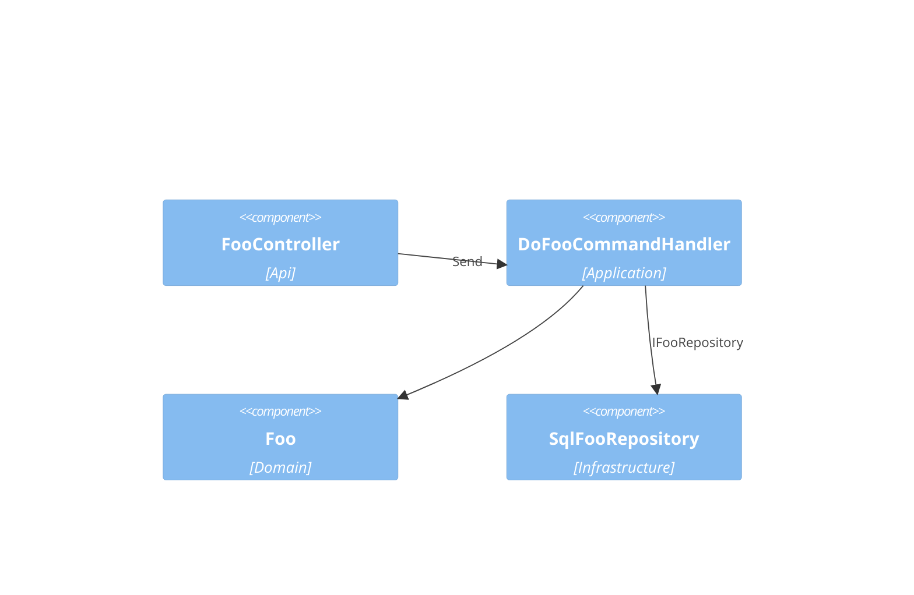
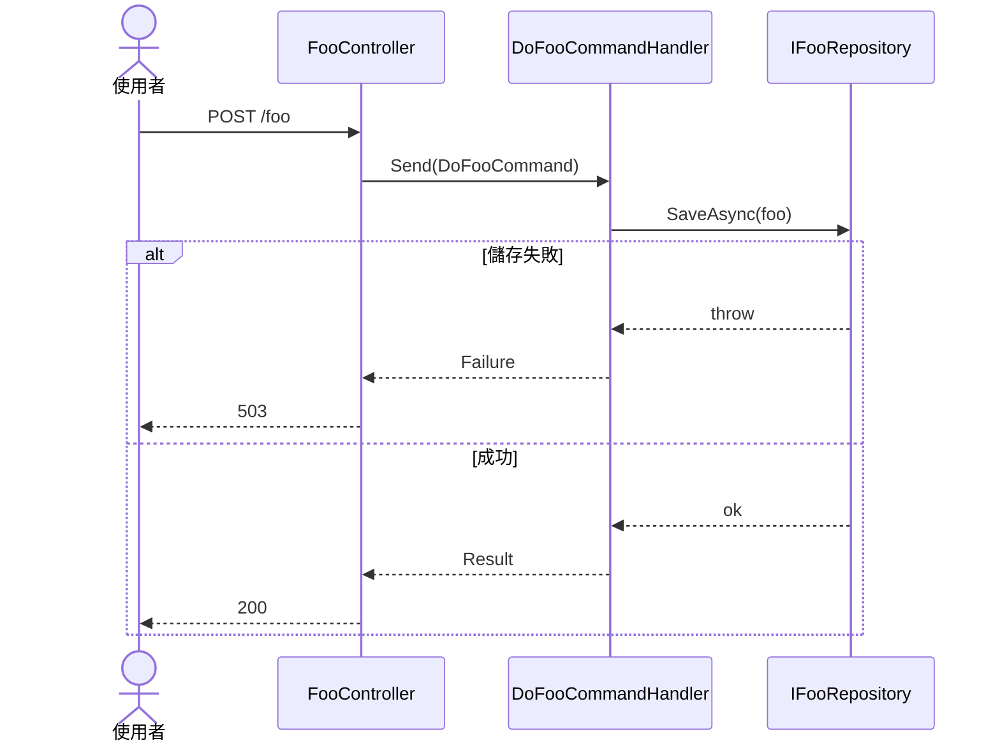

# {feature-title} — 架構(C4)

## Context(L1)
### C4-L1

## Container(L2)
### C4-L2

## Component(L3)
<!-- 名稱欄 'Impl : IInterface' 代表經介面暴露(B2 判定 Application→Infrastructure 是否經介面)。
     depends 寫 CMP ID,逗號分隔;external 寫外部系統名;技術寫套件/框架名,逗號分隔(B8 比對白名單) -->
| ID | 名稱 | Layer | Context | depends | external | 技術 |
|---|---|---|---|---|---|---|
| CMP-001 | FooController | Api | Foo | CMP-002 | | ASP.NET Core |
| CMP-002 | DoFooCommandHandler | Application | Foo | CMP-003, CMP-004 | | MediatR |
| CMP-003 | Foo (Aggregate) | Domain | Foo | | | |
| CMP-004 | SqlFooRepository : IFooRepository | Infrastructure | Foo | | | EF Core |

### C4-L3

## 追溯(AC → 技術元件)
<!-- 每條 AC 至少一列;「職責」寫這個元件為這條 AC 做的事(格式檢查 / 業務規則 / 持久化)。B1 與面板都讀這張表 -->
| AC | CMP | via | 職責 |
|---|---|---|---|
| AC-001-1 | CMP-001 | SEQ-001 | 接收請求、回應 200 |
| AC-001-1 | CMP-002 | SEQ-001 | 編排 |
| AC-001-2 | CMP-003 | SEQ-001 | 業務規則:不變量檢查 |

## Sequence
<!-- 每個 UC 一張;例外流程若互動對象不同,用 alt / opt fragment 畫進同一張,不另開 -->
### SEQ-001(UC-001 / REQ-001)

