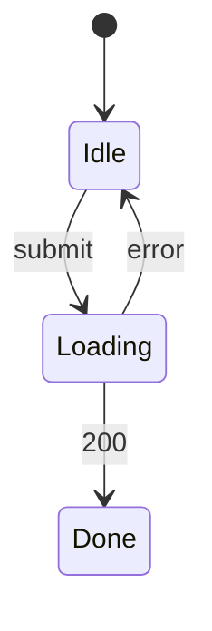

# {feature-title} — UI spec

## 畫面清單
<!-- 每個畫面一列;元件寫 CMP ID(在 30 的 Component 表,Layer = Page / Component / Store / ApiClient);Mock 寫路徑 -->
| 畫面 | 路由 | 元件 | Mock | 對應 REQ |
|---|---|---|---|---|
| FooPage | /foo | CMP-101, CMP-102 | specs/in-progress/foo/mock/foo.html | REQ-001 |

## 介面狀態
### STM-UI-001 FooPage(REQ-001)

## 欄位驗證
| 畫面 | 欄位 | 規則 | 錯誤訊息 | 對應 AC |
|---|---|---|---|---|
| FooPage | name | 必填,≤ 50 字 | 請輸入名稱 | AC-001-2 |
