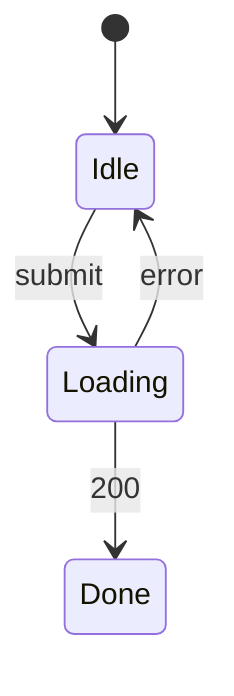

# {feature-title} — UI spec

## 畫面清單
<!-- 每個畫面一列;元件寫 CMP ID(在 30 的 Component 表,Layer = Page / Component / Store / ApiClient);Mock 寫路徑 -->
| 畫面 | 路由 | 元件 | Mock | 對應 REQ |
|---|---|---|---|---|
| FooPage | /foo | CMP-101, CMP-102 | specs/in-progress/foo/mock/foo.html | REQ-001 |

## 畫面元素
<!-- UI 的顆粒度:每個可互動元素一列(按鈕、欄位、連結、清單)。元素寫 mock 的 #id 或 name,工具會對 mock 逐一核對;
     呼叫 API 寫 api/40 介面清單的 ID(endpoint 顆粒度);沒有動作的元素動作寫「無」 -->
| 畫面 | 元素 | 類型 | 動作 | 呼叫 API | 啟用條件 | 對應 AC |
|---|---|---|---|---|---|---|
| FooPage | #save | button | 儲存 | API-001 | 必填已填 | AC-001-1 |
| FooPage | name | input | 無 | | | |

## 介面狀態
### STM-UI-001 FooPage(REQ-001)

## 欄位驗證
| 畫面 | 欄位 | 規則 | 錯誤訊息 | 對應 AC |
|---|---|---|---|---|
| FooPage | name | 必填,≤ 50 字 | 請輸入名稱 | AC-001-2 |
