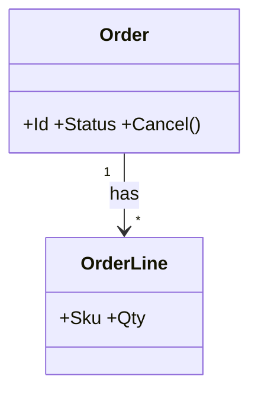

# {feature-title} SA2 實體與關係

## 實體
<!-- 英文欄是 survey 掃 codebase 用的符號;屬性詞不建實體 -->
| 實體 | 英文 | 屬性 | 來源詞 |
|---|---|---|---|
| 訂單 | Order | Id, Status, Total | 訂單 |

## 關係
| 來源 | 關係 | 目標 | 多重性 |
|---|---|---|---|
| Order | has | OrderLine | 1..* |

### CLS-SA-001 實體關係(REQ-001)

