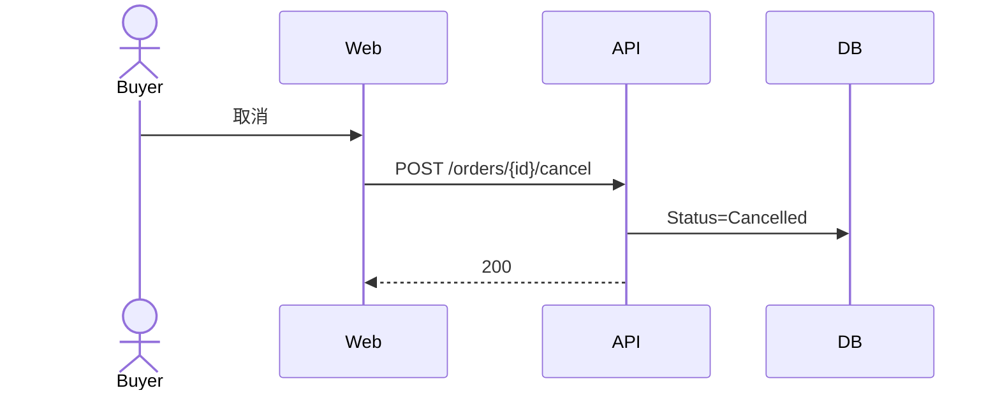

# {feature-title} SA6 Sequence Diagram

系統層級(Web / API / DB / 外部),不到 Component。

## Sequence Diagram
### SEQ-SA-001 {流程名}(REQ-001)

```mermaid
sequenceDiagram
  actor B as Buyer
  participant W as Web
  participant A as API
  participant D as DB
  B->>W: 取消
  W->>A: POST /orders/{id}/cancel
  A->>D: Status=Cancelled
  A-->>W: 200
```
