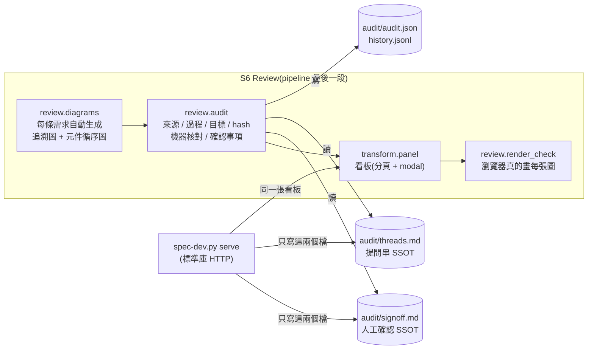

# spec-reviewer:一站式審查(看板 + 審計 + 共同確認)

> 一句話:SA 建模與 RD 設計產出的**每一張圖、每一列 SA 表**,都能在同一張看板上查到「從哪來(來源)、怎麼來(過程)、為了哪條需求(目標)」,
> 機器先核對圖與表是否一致,再由人(PM / QA / RD,可以是同一個人)逐項確認;判斷寫回 md(SSOT),不落在誰的瀏覽器裡。

## 1. 骨架



| 層 | 檔 | 角色 |
|---|---|---|
| 規則 | `rules/review/diagram-checks.yaml` | 圖 ID 前綴 → 機器核對項目(RD 圖) |
| 規則 | `rules/methodology/sa/<方法論>.yaml` 的 `steps[*].audit` | SA 圖與 SA 表格列的核對項目(換方法論就換規格) |
| 規則 | `rules/review/duties.yaml` | 圖 ID 前綴 → **要做哪些確認**(是不是要的 / 測得出來 / 做得出來) |
| 規則 | `rules/gates/G-DG-*`、`G-SA-tables`、`G-S6-render`、`G-RV-threads` | 嚴重度(predicate 只回報情況) |
| 工具 | `tools/review/mermaid_v1.py` | mermaid 文字解析(sequence / state / class / er / C4 / flowchart) |
| 工具 | `tools/review/checks_v1.py` | 核對函式庫:圖 ↔ 元件依賴、SA 實體、SA 角色動作、擁有權 |
| 工具 | `tools/review/audit_v1.py` | 審計項目、hash、確認狀態、歷史 |
| 工具 | `tools/review/signoff_v1.py`、`threads_v1.py` | 寫回 SSOT(hash 防護、理由必填) |
| 工具 | `tools/review/serve_v1.py` | 一站式站台 |
| 工具 | `tools/review/render_check_v1.py` + `browser/verify.js` | 瀏覽器渲染驗證 |

## 2. 審計一張圖看什麼

```
             ┌──────── 來源 ────────┐   ┌──── 過程 ────┐   ┌──── 目標 ────┐
  SEQ-001 →  │ 30-architecture:88   │ + │ method-log #12 │ + │ REQ-002 存在? │
             │ 自動圖:用到的表格列 │   │ 自動圖:工具名  │   │ 需求類圖必須有 │
             └──────────────────────┘   └───────────────┘   └───────────────┘
                        │ 機器核對(依前綴 / 方法論)
                        ▼
   呼叫是否沿著元件 depends?類別在 SA2 嗎?事件是 SA3 動作嗎?實體有 owner 嗎?
                        │ 內容 hash(正規化後 sha256 前 12 碼)
                        ▼
   人工確認(一張圖 × 一個確認事項):通過 / 退回(寫怎麼改)/ 不需要(寫理由)/ 未決
   通過後圖一改 → hash 不同 → 自動變「過期」,要重新確認
```

## 3. 確認事項:以事情區分,不以人區分

| 確認事項 | 問題 | 通常的視角 |
|---|---|---|
| `intent` 是不是要的 | 圖表達的流程 / 狀態 / 關係,等於需求本意嗎?缺口回答了嗎? | PM |
| `testable` 測得出來 | 每條路徑(含例外、狀態轉移)都有 AC 或測試能驗證嗎? | QA |
| `buildable` 做得出來 | 元件、依賴、資料、介面做得出來,而且守住技術邊界嗎? | RD |

- **同一個人可以一次做完多項**(跨職能常見);看板上「全部通過」一鍵勾完。視角只是提示,不是權限。
- 「不需要」是正式決定,必須寫理由,算做完 —— 事情要不要做本身也留下紀錄。
- 一張圖的狀態 = 彙總:任一項退回 → 退回(FAIL);任一項過期 → 過期(WARN);全部做完才算完成。

## 4. 看板:分頁 + modal

- 分頁登錄表(`TABDEF`):總覽、證據鏈、審計與確認、需求×元件×測試、技術邊界、SA 建模、名詞與 codebase、方法論 log。
  `.spec-dev.yaml` 的 `board.tabs` 決定顯示哪些、順序;`board.default_tab` 決定預設分頁。
- **圖、名詞表、SA 表、Survey 全表預設不展開**,看板上只有晶片;點了開 modal,一次只看一張圖或一張表。
  modal 有可分享的連結:`check-panel.html#tab=audit&open=aud:SEQ-001`(`dg:` 圖、`tb:` 表、`aud:` 審計項目)。
- 名詞表、分層命名、Survey 全表在 modal 內可篩選。

## 5. 兩種用法

| | 靜態快照(`spec-dev.py review`)| 一站式站台(`spec-dev.py serve`)|
|---|---|---|
| 適合 | 一個人看、發佈成 artifact、CI 產物 | PM / QA / RD 共同核對 |
| 判斷存哪 | 本機瀏覽器 → 產生 `signoff` 指令或 md 列,手動套用 | 直接寫回 `audit/signoff.md`、`threads.md` |
| 提問 | 只讀 | 每張圖可提問、回答、結案;未結提問進 Gate(WARN) |
| 看原文 | — | 點任何「檔:行」→ 原文抽屜,標出那一行 |
| 新鮮度 | 產生當下 | md 一改就重建;別人做了確認會提示重新整理 |

```bash
python3 spec-dev.py review specs/rd/issue-c/spec                     # 全流程 + 審計 + 瀏覽器渲染驗證
python3 spec-dev.py serve  specs/rd/issue-c/spec --port 8110          # 預設只綁 127.0.0.1
python3 spec-dev.py signoff specs/rd/issue-c/spec SEQ-001 --duty buildable,testable --hash 1a2b3c4d5e6f --by Paul
python3 spec-dev.py signoff specs/rd/issue-c/spec AUTO-SEQ-REQ-001 --duty buildable --na --note "沿用既有流程" --by Amy
```

## 6. 站台的邊界(刻意的)

- 只用標準庫;spec 與 codebase 唯讀,**唯一的寫入**是 `review_dir/audit/signoff.md` 與 `threads.md`。
- 讀檔路徑解析後逃出專案根目錄 → 與「不存在」同一句話。
- 拒絕(hash 不符、事項不屬於這張圖、退回或不需要沒寫理由)回 200 + `error`;body 不是 JSON 物件回 400;未知路徑 404。
- **沒有認證**:審核者名字是自報的,稽核依據是 `signoff.md` 的 git 歷史。要給團隊用就綁內網 IP;要防冒名需要在前面加認證(未做)。
- 站台重建不跑瀏覽器渲染驗證(看板本身就在瀏覽器裡);正式驗證跑 `review`。

## 7. 能力邊界(誠實版)

| 能抓到 | 抓不到 |
|---|---|
| 圖的呼叫違反元件依賴、C4 關係不在依賴表、類別 / 實體 / 事件對不到表 | 圖「語意」錯但結構與表一致(例:循序順序合理但業務上順序錯)—— 這是 `intent` 要人確認的原因 |
| 圖指向不存在的需求、需求類圖沒有目標、手寫圖沒有過程紀錄 | 過程紀錄是否真的照做(log 是宣稱,不是證明) |
| 圖改了而簽核還是舊的(hash) | 簽核者是否真的看過(站台無認證) |
| 圖在瀏覽器畫不出來、看板 JS 壞掉、點開 modal 沒圖 | 圖畫得出來但難讀 |

## 8. 驗證

```bash
python3 -m unittest tests.unit.test_reviewer          # 解析、核對、自動圖、審計、確認事項(hash 防護、不需要要理由、同一人多項)
python3 -m unittest tests.rules.test_rule_cases       # G-DG-* / G-SA-tables / G-S6-render / G-RV-threads 資料驅動案例
python3 -m unittest tests.e2e.test_serve              # 站台 API(路徑穿越、hash、提問)+ 瀏覽器流程
python3 -m unittest tests.e2e.test_panel_browser      # 分頁、晶片 → modal、全部圖畫得出來、審計確認 → 指令
```
