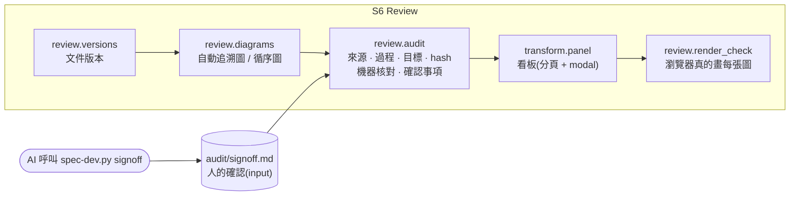

# spec-reviewer:看板 + 審計(S6)

> 一句話:SA 建模與 RD 設計產出的**每一張圖、每一列 SA 表**,都查得到「從哪來(來源)、怎麼來(過程)、為了哪條需求(目標)」;
> 機器先核對圖與表是否一致,人再逐項確認。**各司其職:input 是 md、tools 給 AI 呼叫、rules 是 YAML、看板只給人看。**

## 1. 各司其職

```
input   md:PM spec、RD spec、SA 各步驟、survey、名詞表、audit/signoff.md(人的確認)   ← 人與 AI 編輯
tools   spec-dev.py review / signoff / …                                               ← AI 呼叫(人也可以)
rules   rules/**/*.yaml:判定與嚴重度、哪類圖做哪些核對與確認                          ← 改規則不改程式
output  check-panel.html(看板,只給人看)、報告、audit/audit.json、versions.jsonl    ← 產生物,不手改
```

- 看板**不收輸入**:沒有表單、不存瀏覽器狀態、不需要伺服器。要確認某張圖,告訴 AI,由 AI 呼叫 `signoff`;看板在每個待確認事項旁附上那一行工具呼叫供參考。
- 工具**不畫畫面**:輸出 md / json / 看板檔,退出碼表示有無 FAIL。



| 層 | 檔 | 角色 |
|---|---|---|
| rules | `rules/review/diagram-checks.yaml` | 圖 ID 前綴 → 機器核對項目(RD 圖) |
| rules | `rules/methodology/sa/uml-wordbreak.yaml` 的 `steps[*].audit` | SA 圖與 SA 表格列的核對項目(換方法論就換規格) |
| rules | `rules/review/duties.yaml` | 圖 ID 前綴 → 要做哪些確認(是不是要的 / 測得出來 / 做得出來) |
| rules | `rules/gates/G-DG-signoff.yaml`、`G-SA-tables.yaml`、`G-S6-render.yaml` 等 | 嚴重度(predicate 只回報情況) |
| tools | `tools/review/mermaid_v1.py`、`tools/review/checks_v1.py` | mermaid 文字解析;圖 ↔ 元件依賴 / SA 實體 / SA 角色動作 / 擁有權 |
| tools | `tools/review/audit_v1.py`、`tools/review/versions_v1.py`、`tools/review/diagrams_v1.py` | 審計項目、內容 hash、確認狀態;文件版本;自動圖 |
| tools | `tools/review/signoff_v1.py` | 把確認寫進 `audit/signoff.md`(hash 防護、理由必填) |
| tools | `tools/review/render_check_v1.py` + `tools/review/browser/verify.js` | 瀏覽器渲染驗證 |

## 2. 審計一張圖看什麼

```
  SEQ-001 → 來源 30-architecture:88 · 過程 method-log #12 · 目標 REQ-002(存在?)
            機器核對:呼叫沿著元件 depends?類別在 SA2?事件是 SA3 動作?實體有 owner?
            內容 hash(正規化後 sha256 前 12 碼)
            人工確認(一張圖 × 一個確認事項):通過 / 退回(寫怎麼改)/ 不需要(寫理由)
            通過後圖一改 → 過期;圖沒改但依據的需求改了 → 上游已變
```

## 3. 確認事項:以事情區分,不以人區分

| 確認事項 | 問題 | 通常的視角 |
|---|---|---|
| `intent` 是不是要的 | 圖表達的流程 / 狀態 / 關係,等於需求本意嗎? | PM |
| `testable` 測得出來 | 每條路徑(含例外、狀態轉移)都有 AC 或測試能驗證嗎? | QA |
| `buildable` 做得出來 | 元件、依賴、資料、介面做得出來,而且守住技術邊界嗎? | RD |

誰都可以確認,名字只是紀錄;視角只是提示,不是權限。「不需要」附理由也算做完。未確認是 INFO(不擋),只有退回是 FAIL。

```bash
spec-dev.py signoff <spec> --id SEQ-001 --duty buildable,testable --hash 1a2b3c4d5e6f --by 小明
spec-dev.py signoff <spec> --id AUTO-SEQ-REQ-001 --duty buildable --na --note "沿用既有流程" --by Amy
spec-dev.py signoff <spec> --id SEQ-002 --duty intent --reject --note "少了退回路徑" --by Paul
```
hash 必須是看過的那一版,不同就拒絕(避免簽到沒看過的內容)。

## 4. 證據強弱(survey existing / modify)

| 強度 | 條件 | 判定 |
|---|---|---|
| 強 | `path:line "字面文字"`,該行含字面且**不是函式宣告行** | 放行(INFO) |
| 弱 | 該行含元素符號(ASCII → 詞彙表 → 命名對照 → SA2 → lexicon) | 放行(INFO),看板「已放行」標「弱」並計數 |
| 宣告行 | 指在函式 / 方法宣告行 | WARN「只證明函式存在,不證明行為」;同列另有行為行證據通過就不 WARN |
| 對不上 | 該行沒有字面 / 符號 | FAIL |

看板總覽最前面是「已放行」:放行了什麼、憑什麼、強還是弱。固定對照組在 `tests/rules/cases/G-SV-evidence.yaml` 的 `control_*`。

## 5. 文件版本

每次 review 替追蹤的文件(PM spec、mock、參考文件、SA、RD spec、survey、名詞表)留指紋:文件 → 段落 → 需求上游鍵(`pm:REQ-x` PM 段落、`req:REQ-x` 需求列 + AC)。
有變才記一版(`audit/versions.jsonl`,內容定址 blob 做 diff,不靠 git;有 git 另記 commit)。確認時記下版本;之後依據的上游變了 → 「上游已變,請重看」。

## 6. 看板(只給人看)

- 分頁:總覽(已放行、Gate)、證據鏈、審計與確認、版本、需求×元件×測試、技術邊界、SA 建模、名詞與 codebase、方法論 log。`board.tabs` / `board.default_tab` 可調。
- 圖、名詞表、SA 表、Survey 全表、diff 預設不展開,點晶片開 modal;modal 有分享連結 `#tab=audit&open=aud:SEQ-001`。
- 點「檔:行」看原文:追蹤中的文件內嵌全文,survey 引用的程式碼內嵌前後 6 行。不需要伺服器。
- `spec-dev.py review <spec> --watch`:md 一改就重建看板。

## 7. 能力邊界

| 能抓到 | 抓不到 |
|---|---|
| 圖的呼叫違反元件依賴、C4 關係不在依賴表、類別 / 實體 / 事件對不到表 | 圖語意錯但結構與表一致 —— 所以要人確認 `intent` |
| 圖指向不存在的需求、需求類圖沒有目標、手寫圖沒有過程紀錄 | 過程紀錄是否真的照做(log 是宣稱) |
| 圖改了或依據的需求改了,而確認還是舊的 | 確認者是否真的看過(名字只是紀錄) |
| 證據只比對到名字(弱)、指在函式宣告行 | 證據指在行為行、字面也對,但宣稱本身錯 |
| 看板 JS 壞掉、圖畫不出來、點開 modal 沒圖 | 圖畫得出來但難讀 |

## 8. 驗證

```bash
python3 tests/run.py fast    # 約 20 秒:單元、規則案例(含固定對照組)、契約、testcase1、版本
python3 tests/run.py slow    # 數分鐘:CLI、測試矩陣、真瀏覽器(看板只顯示、modal、全部圖畫得出來)
```
